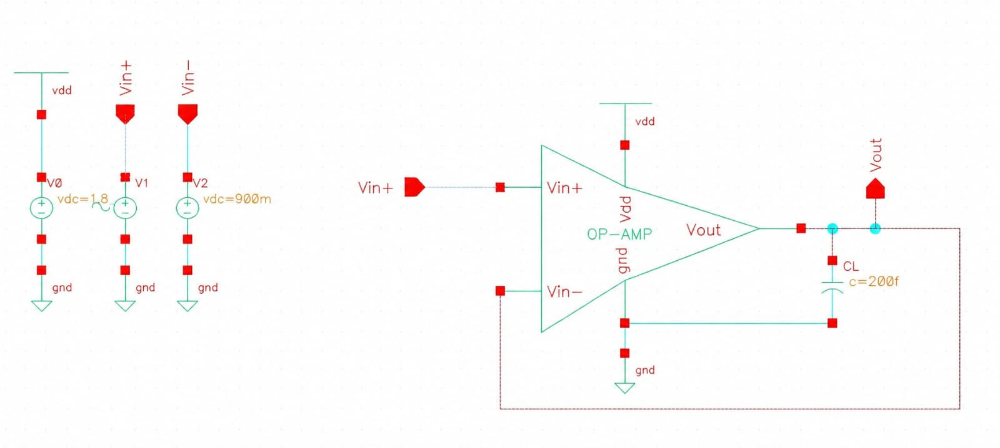

# Two-Stage CMOS Operational Amplifier – Unity Gain Buffer

## Project Overview

This project presents the design and simulation of a **two-stage CMOS operational amplifier configured as a Unity Gain Buffer (Voltage Follower)** using the **Cadence Virtuoso** design environment.

The project focuses on CMOS analog integrated circuit design, including differential input-stage design, current mirror biasing, active loading, second-stage voltage gain, Miller compensation, frequency-response analysis, stability evaluation, and transient analysis.

---

## Objectives

- Design a two-stage CMOS operational amplifier.
- Implement CMOS differential input and gain stages.
- Design current mirrors for transistor biasing.
- Implement Miller compensation for frequency stability.
- Configure the operational amplifier as a unity gain buffer.
- Analyze DC gain, bandwidth, phase margin, and transient response.
- Evaluate the theoretical slew rate of the design.

---

## Circuit Architecture

The operational amplifier consists of the following major blocks:

1. Differential input stage
2. PMOS current mirror active load
3. NMOS bias current mirror
4. Second-stage common-source amplifier
5. Miller compensation capacitor
6. Unity-gain negative-feedback configuration

### Two-Stage CMOS Op-Amp

### Unity Gain Buffer

---

## Design Methodology

### 1. Input Stage Design

The first stage uses an NMOS differential pair to amplify the difference between the input signals. A PMOS current mirror is used as an active load to provide differential-to-single-ended conversion and improve voltage gain.

### 2. Second Stage Gain Design

The second stage is implemented using a common-source amplifier with an active PMOS load. This stage provides additional voltage gain and drives the output node.

### 3. Current Mirror Design

Current mirrors are used to establish the required bias currents and provide active loads. Proper transistor sizing is used to maintain suitable operating conditions and current matching.

### 4. Miller Compensation

A compensation capacitor is connected between the first and second gain stages to introduce a dominant pole and improve the stability of the operational amplifier.

### 5. Unity Gain Configuration

The output is connected directly to the inverting input, while the signal is applied to the non-inverting input. This creates 100% negative feedback and configures the circuit as a voltage follower.

---

## Simulation Setup

The circuit was designed and simulated using **Cadence Virtuoso**.

| Parameter | Value |
|---|---:|
| Supply Voltage | 1.8 V |
| Common-Mode Voltage | 0.9 V |
| Bias Current | 15 µA |
| Compensation Capacitor | 5 pF |
| Load Capacitance | 0.2 pF |
| Configuration | Unity Gain Buffer |

The circuit was evaluated using DC, AC, and transient analyses.

---

## Simulation Results

### Open-Loop AC Analysis

The open-loop frequency response was analyzed to determine the DC gain, unity-gain bandwidth, and phase margin.

### Measured Parameters

| Parameter | Result |
|---|---:|
| DC Gain | 66.64 dB |
| Unity-Gain Bandwidth | 3.238 MHz |
| Phase Margin | 66.64° |

---

## Slew Rate Calculation

The theoretical slew rate is calculated using:

\[
SR = \frac{I}{C_L}
\]

where:

- \(I = 15\,\mu A\)
- \(C_L = 0.2\,pF\)

Therefore,

\[
SR = \frac{15\times10^{-6}}{0.2\times10^{-12}}
\]

\[
SR = 75\times10^6\ V/s
\]

Hence,

\[
\boxed{SR = 75\ V/\mu s}
\]

**The calculated theoretical slew rate is 75 V/µs.**

---

## Performance Summary

| Parameter | Value |
|---|---:|
| Technology | CMOS |
| Supply Voltage | 1.8 V |
| DC Gain | 66.64 dB |
| Unity-Gain Bandwidth | 3.238 MHz |
| Phase Margin | 66.64° |
| Bias Current | 15 µA |
| Compensation Capacitor | 5 pF |
| Load Capacitance | 0.2 pF |
| Theoretical Slew Rate | 75 V/µs |
| Configuration | Unity Gain Buffer |

---

## Tools & Technologies

- Cadence Virtuoso
- CMOS Analog IC Design
- Two-Stage CMOS Op-Amp
- Differential Amplifier
- Current Mirror
- Miller Compensation
- DC Analysis
- AC Analysis
- Transient Analysis
- Frequency Response and Stability Analysis

---

## Learning Outcomes

Through this project, I gained practical understanding of:

- Two-stage CMOS operational amplifier architecture
- MOSFET biasing and transistor sizing
- Differential pair design
- Current mirror implementation
- Active-load design
- Miller compensation
- Frequency response and phase margin
- Unity-feedback configuration
- Cadence Virtuoso schematic and simulation workflow
- Analog IC performance evaluation

---

## Future Improvements

- Perform transistor-level layout.
- Perform DRC and LVS verification.
- Perform post-layout simulation with parasitic extraction.
- Analyze PVT corners.
- Optimize power consumption and bandwidth.
- Analyze input-referred offset and noise.
- Improve settling time and large-signal performance.

---

## Project Status

**Completed – Schematic Design and Simulation**

This project demonstrates the design and simulation of a CMOS two-stage operational amplifier and its implementation as a unity gain buffer using Cadence Virtuoso.
